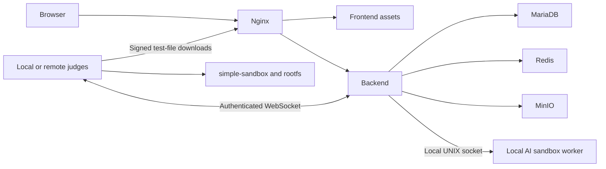

# LLMOJ

English | [简体中文](README.zh-CN.md)

## Quick installation

Replace `houyhlouis/LLMOJ` with your public repository. On an Ubuntu 24.04 / 26.04 amd64 server, download and run the English installer:

```bash
curl -fsSL https://raw.githubusercontent.com/houyhlouis/LLMOJ/main/install.sh -o /tmp/llmoj-install.sh && sudo bash /tmp/llmoj-install.sh --repository houyhlouis/LLMOJ
```

## Features and what LLMOJ adds

**LLMOJ combines a LibreOJ-based online judge with LLM-assisted problem authoring and learning.** Submissions are compiled, executed and scored by the judge; AI assists with content and authoring workflows. Connect your own model and search services. No model weights, shared API keys or preconfigured accounts are included.

### AI-assisted problem authoring

- **Statement import and translation:** organize statement content and translate it between languages, with editable output for review.
- **Problem source discovery:** combine search evidence and semantic checks to help identify the original source.
- **Analysis and explanations:** request tags, difficulty suggestions and tutorial assistance within the problem workflow.
- **Test-data generation with execution checks:** generate reference solutions, generators and validation programs, compile and run them inside the judge sandbox, and validate output before activating the supported data installation workflow. Generated problems and data remain private by default.

AI output requires review and is not a correctness guarantee. Program execution currently needs a local sandbox worker on the web server.

### Private, configurable AI workflows

- User-owned model, search and MCP configuration, with user-supplied service credentials.
- Provider keys encrypted with AES-256-GCM; configuration responses report whether a key exists without returning it.
- Bounded job concurrency, progress, checkpoints, cancellation and retries.
- Writes recheck current permissions and the problem snapshot. Usage metadata excludes API keys and prompt/response bodies.

### A complete competitive programming platform

- Chinese and English UI, browser code editor, problem sets, private study lists, discussions and permission management.
- Traditional, interactive, communication and output-only problems.
- NOI, IOI and ICPC contest rules, permissions, scoreboards and private contest summaries.
- Original LibreOJ `simple-sandbox` and rootfs recipe, filesystem/network isolation and cgroup resource limits. NOI Linux 2.0 is not bundled or used.
- Multiple remote judges for ordinary submissions, each with separate credentials.

### Deployment choices

- A standalone GitHub shell entry point downloads a pinned source commit. Public repositories need no GitHub login.
- Interactive port, hostname, site name, installation directory, deployment role and Docker sources.
- Automatic systemd configuration and a full-permission `admin` account with a random password.
- Complete (`all`) or web-only (`web`) deployment, with independent judge and HTTPS tutorials.

## Installation details

Requirements: Ubuntu 24.04 / 26.04 amd64, a normal VM or physical server, systemd 254+, cgroup v2 and at least 3 GiB RAM. Complete installation needs 30 GiB free disk; web-only needs 10 GiB. For compilation, 8 GiB RAM and 40 GiB disk are recommended. First installation downloads dependencies and builds the application and, in complete mode, rootfs.

| Option | Default / behavior |
| --- | --- |
| Website listener | `0.0.0.0:80`; browse `http://SERVER_IP` without a port suffix |
| Site name | `LLMOJ`; customizable |
| Deployment | `--role all`; `web` omits local judging/rootfs |
| Installation directory | `/opt/LibreOJ`, retained for path compatibility |
| Docker package source | `--docker-source https://download.docker.com` |
| Docker Hub mirrors | `--docker-mirrors URL[,URL]`; empty keeps existing Docker defaults |
| Local judge slots | Automatic by CPU/RAM; override with `--judge-slots 1..7` |

Missing Docker is installed when rootfs must be built. Package repositories and image mirrors are separate options. The installer appends `/linux/ubuntu` to the package source base URL and retains Docker's official signing key. Custom Hub mirrors are merged into Docker configuration, preserving other settings and backing up the original; applying a change restarts Docker and can affect existing containers. Blank input leaves mirror configuration unchanged. See [Docker sources](wiki/Docker-Sources.md).

```bash
# Non-interactive example; substitute your own mirror URLs:
sudo bash /tmp/llmoj-install.sh --repository houyhlouis/LLMOJ \
  --yes --port 8080 --public-url http://oj.example.com:8080 \
  --docker-source https://YOUR_PACKAGE_MIRROR/docker-ce \
  --docker-mirrors https://YOUR_DOCKER_HUB_MIRROR
```

Pin releases with `--ref VERSION_TAG_OR_COMMIT`, and pin the downloaded script URL to that same version. With local source, run `sudo bash deploy/install.sh`. `--plan` shows steps; `--check` checks the environment without installing. Firewalls and TLS are configured separately. Database, Redis, MinIO, backend and metrics stay on loopback. Configure [HTTPS](wiki/HTTPS.md) before sending public-internet credentials.

After success, the installer prints `admin` and a random 32-character password, with all administrator permissions. Credentials are saved in root-owned `config/admin-credentials.json`, mode `0600`; retries retain the password. Save it and change it after your first login.

## Architecture and distributed judging



Ordinary judging supports multiple remote nodes. AI reference-solution validation and test-data generation currently use a local UNIX socket and private shared directories. Adding a remote judge does not move these actions off the web server. Use `all` plus remote judges for full AI execution, or accept that limitation with `web`.

## Documentation

- [English Wiki](wiki/Home.md) · [中文 Wiki](wiki/Home.zh-CN.md)
- [Installation](wiki/Installation.md) · [Docker sources](wiki/Docker-Sources.md)
- [Distributed judging](wiki/Distributed-Judging.md) · [Remote judge setup](wiki/Remote-Judge.md)
- [AI configuration](wiki/AI.md) · [HTTPS](wiki/HTTPS.md)
- [GitHub and Wiki publishing](wiki/Publishing.md)

Wiki source is included. GitHub Wiki is a separate repository; uploading these files does not publish it automatically. `deploy/export-wiki.py` exports both languages.

## License and release scope

The main source is **MIT**, retaining LibreOJ's copyright and license. See [LICENSE](LICENSE) and [third-party notices](THIRD_PARTY_NOTICES.md); third-party software, fonts and the rootfs recipe retain their own licenses.

The source package includes application/judge code, sandbox source, the original rootfs recipe, installers and bilingual documentation. It excludes complete rootfs, NOI Linux images, installed binaries, databases, real credentials and debugging output. Rootfs is built during installation. See [package contents](deploy/SOURCE-PACKAGE.md).

Configuration and build checks exist; fresh-server one-command installation and real multi-machine deployment have not yet been validated end to end. [Development notes](README-DEVELOPMENT.md).
