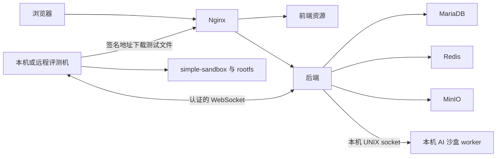

# LLMOJ

[English](README.md) | 简体中文

## 一键安装

将 `houyhlouis/LLMOJ` 替换为实际公开仓库，在 Ubuntu 24.04 / 26.04 amd64 服务器下载并运行中文安装器：

```bash
curl -fsSL https://raw.githubusercontent.com/houyhlouis/LLMOJ/main/install.zh-CN.sh -o /tmp/llmoj-install.zh-CN.sh && sudo bash /tmp/llmoj-install.zh-CN.sh --repository houyhlouis/LLMOJ
```

## 功能与创新点

**LLMOJ 将基于 LibreOJ 的在线评测平台与大语言模型辅助出题、学习流程结合起来。** 提交通过评测机编译、运行与评分，AI 用于内容和出题辅助。用户接入自己的模型与搜索服务；项目不附带模型权重、共享 API Key 或预置账号。

### AI 辅助出题

- **题面导入与翻译：** 整理题面内容、跨语言翻译，结果可继续编辑与审核。
- **题目来源检索：** 结合搜索证据与语义核对，辅助寻找题目原始来源。
- **分析与讲解：** 在题目工作流中获得标签、难度建议和题解辅助。
- **带执行验证的测试数据生成：** 生成标程、数据生成器与校验程序，通过评测沙盒编译和运行，在受支持的数据安装流程启用前校验输出。生成题目和数据默认私有。

AI 内容需要审核，生成结果不代表正确性保证。程序执行目前需要网页服务器上的本机沙盒 worker。

### 私有、可配置的 AI 工作流

- 模型、搜索与 MCP 配置属于用户，由用户提供自己的服务凭据。
- key 使用 AES-256-GCM 加密保存；读取配置只返回是否已配置，不返回原 key。
- 任务支持有界并发、进度、检查点、取消和重试。
- 写入前核对当前权限与题目快照；使用统计不包含 key、提示词或模型响应正文。

### 完整的算法竞赛平台

- 中英文界面、浏览器代码编辑器、题库、私有题单、讨论与权限管理。
- 传统题、交互题、通信题和提交答案题。
- NOI、IOI、ICPC 赛制、比赛权限、排行榜和私有比赛总结。
- 原版 LibreOJ `simple-sandbox` 和 rootfs 配方，具有文件系统、网络隔离与 cgroup 资源限制。不内置或使用 NOI Linux 2.0。
- 普通提交支持多台远程评测机，每台使用独立凭据。

### 灵活部署

- 独立 GitHub shell 入口下载固定提交源码；公开仓库无需 GitHub 登录。
- 交互设置端口、域名、站名、安装目录、部署模式和 Docker 源。
- 自动配置 systemd，创建全权限 `admin` 与随机密码。
- 完整 `all` 或仅网页 `web` 部署，配套独立评测机和 HTTPS 教程。

## 安装详情

需要 Ubuntu 24.04 / 26.04 amd64、普通虚拟机或物理机、systemd 254+、cgroup v2，至少 3 GiB 内存。完整安装需 30 GiB 空闲磁盘，仅网页安装需 10 GiB；编译建议 8 GiB 内存和 40 GiB 磁盘。首次安装下载依赖并构建项目，完整模式还构建 rootfs。

| 选项 | 默认值 / 行为 |
| --- | --- |
| 站点监听 | `0.0.0.0:80`，直接访问 `http://服务器IP` |
| 站名 | `LLMOJ`，可自定义 |
| 部署模式 | `--role all`；`web` 不安装本机评测/rootfs |
| 安装目录 | `/opt/LibreOJ`，保留路径兼容 |
| Docker 软件包源 | `--docker-source https://download.docker.com` |
| Docker Hub 镜像加速源 | `--docker-mirrors URL[,URL]`，留空保留 Docker 现有默认设置 |
| 本机评测并发 | 按 CPU/内存自动选择，可用 `--judge-slots 1..7` 指定 |

需要构建 rootfs 时自动安装缺失的 Docker。软件包源和镜像加速源分别设置：软件包源输入基础 URL，脚本追加 `/linux/ubuntu`，签名 key 仍从 Docker 官方取得。镜像加速源合并写入 Docker 配置，保留其他设置并备份原文件；应用变更会重启 Docker，可能影响已有容器。留空不更改镜像源配置。见 [Docker 源教程](wiki/Docker-Sources.zh-CN.md)。

```bash
# 无人值守示例；替换自己的镜像源地址：
sudo bash /tmp/llmoj-install.zh-CN.sh --repository houyhlouis/LLMOJ \
  --yes --port 8080 --public-url http://oj.example.com:8080 \
  --docker-source https://YOUR_PACKAGE_MIRROR/docker-ce \
  --docker-mirrors https://YOUR_DOCKER_HUB_MIRROR
```

用 `--ref 版本标签或提交` 固定版本，下载脚本 URL 也应固定到同一版本。本地源码运行 `sudo bash deploy/install.zh-CN.sh`。`--plan` 只显示流程，`--check` 只检查环境。防火墙和 TLS 单独配置；数据库、Redis、MinIO、后端与指标只监听本机。公网传输凭据前配置 [HTTPS](wiki/HTTPS.zh-CN.md)。系统包管理器和构建工具保留自身输出语言。

成功后输出 `admin` 和随机 32 字符密码，授予全部管理员权限。凭据保存在 root 所有、`0600` 的 `config/admin-credentials.json`；重试不重置密码。保存密码并在首次登录后修改。

## 原理与分布式评测



普通评测支持多个远程节点。AI 标程验证和数据生成目前使用本机 UNIX socket 与私有共享目录，新增远程评测机不会迁移这些能力。完整 AI 执行采用 `all` 加远程评测机；纯网页 `web` 模式需接受这一限制。

## 文档

- [中文 Wiki](wiki/Home.zh-CN.md) · [English Wiki](wiki/Home.md)
- [安装教程](wiki/Installation.zh-CN.md) · [Docker 源](wiki/Docker-Sources.zh-CN.md)
- [分布式评测](wiki/Distributed-Judging.zh-CN.md) · [独立评测机](wiki/Remote-Judge.zh-CN.md)
- [AI 配置](wiki/AI.zh-CN.md) · [HTTPS](wiki/HTTPS.zh-CN.md)
- [GitHub 与 Wiki 发布](wiki/Publishing.zh-CN.md)

Wiki 源码随仓库提供；GitHub Wiki 是单独仓库，上传文件不会自动发布 Wiki。`deploy/export-wiki.py` 可导出全部中英文页面。

## 许可与发布范围

主体采用 **MIT**，保留 LibreOJ 原版权与许可，见 [LICENSE](LICENSE) 和 [第三方声明](THIRD_PARTY_NOTICES.md)。第三方软件、字体和 rootfs 配方保留自身许可。

源码包包含应用、judge、沙盒源码、原版 rootfs 配方、安装脚本及双语文档；不含完整 rootfs、NOI Linux 镜像、安装后二进制、数据库、真实凭据或调试产物。rootfs 在安装时构建。见 [源码包内容](deploy/SOURCE-PACKAGE.md)。

已有配置与构建检查；尚未在全新服务器完整验证一键安装，也尚未完成真实多机端到端部署验收。见 [开发说明](README-DEVELOPMENT.md)。
