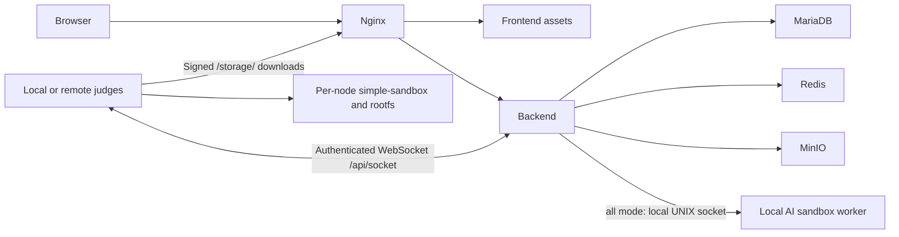

# Distributed judging and web/judge separation

English | [简体中文](Distributed-Judging.zh-CN.md)

## Architecture and deployment layouts

For full AI execution, use `--role all` on the web node, keeping its local judge/AI worker, then add remote judges for ordinary submissions. For complete separation, use `--role web`; it does not build local rootfs, so remote judges handle ordinary submissions.



Judges initiate connections and need no inbound web port. They do not hold database, Redis or MinIO administrator credentials. They receive tasks, download/cache test files through signed URLs and return results. This deployment uses a single backend, not a highly available backend/database cluster.

## Web node

```bash
sudo bash /tmp/llmoj-install.sh --repository houyhlouis/LLMOJ \
  --role web --public-url http://oj.example.com
```

For public remote judging, configure the final [HTTPS](HTTPS.md) origin first, or use a controlled private network. HTTP sends judge credentials without transport encryption.

The installer configures WebSocket Upgrade at `/api/socket` and sets `services.minio.forJudge.urlEndpoint` to the public origin's `/storage/`. Nginx restores the internal Host used in MinIO signatures. Database and MinIO remain on loopback.

## Register each judge

An administrator registers a node with `POST /api/judgeClient/addJudgeClient` and body `{"name":"judge-01","allowedHosts":[]}`.

In the browser Console on the site while logged in as admin, run this request. It uses the current session without printing or copying its token:

```javascript
if (!window._appState?.currentUser?.isAdmin) throw new Error('Sign in as an administrator first');
fetch('/api/judgeClient/addJudgeClient', {
  method: 'POST',
  headers: {
    'Content-Type': 'application/json',
    'Authorization': 'Bearer ' + window._appState.token
  },
  body: JSON.stringify({name: 'judge-01', allowedHosts: []})
}).then(response => response.json()).then(result => {
  console.log(result.judgeClient ? 'Created; save the key privately from this response' : result);
});
```

In the Network panel, save `judgeClient.key` from that response to this node's private key file. Register each machine separately. A new connection using the same key replaces the previous session; do not share keys between judges.

The gateway authenticates keys. Although the API stores `allowedHosts`, the current connection logic does not enforce source-IP checking through that field. Use a reverse proxy, VPN or firewall for source restrictions.

## Deploy and verify

Follow [Remote-Judge](Remote-Judge.md) using the same source version/rootfs recipe as the web node. After “Successfully authorized as …”, query status from the administrator Console:

```javascript
fetch('/api/judgeClient/listJudgeClients', {
  headers: {'Authorization': 'Bearer ' + window._appState.token}
}).then(response => response.json()).then(result => {
  console.table(result.judgeClients?.map(({id, name, online}) => ({id, name, online})));
});
```

Submit a simple C++ program and confirm downloading, compilation, execution and Accepted. Test compilation errors, time/memory limits and cancellation on each node. Restart a node to inspect recovery; multiple clients can consume the queue, but recovery is not an exactly-once execution guarantee.

## AI limitation

Backend model calls, editing, translation and search can still be configured. AI reference-solution validation and test-data generation currently use a local UNIX socket and private shared directories on the web server; there is no cross-machine AI worker protocol. Adding remote judges for ordinary submissions does not move these actions off the web server. They need the local worker retained by `all` and are unavailable with `web`. Do not replace the private socket with an open TCP service or uncontrolled shared directory.

## Troubleshooting

- Connection fails: check final origin, TLS, `/api/socket` Upgrade and the node's key.
- Online but downloads fail: inspect signed URLs for localhost/private endpoints and check `/storage/` Host handling.
- Nodes replace one another: check for shared keys.
- cgroup errors: check systemd delegation, cgroup v2 and kernel support.
- AI execution fails despite remote judges: check whether the web node retains a local worker.

Real multi-machine deployment has not yet been validated end to end; complete the on-site tests above.
