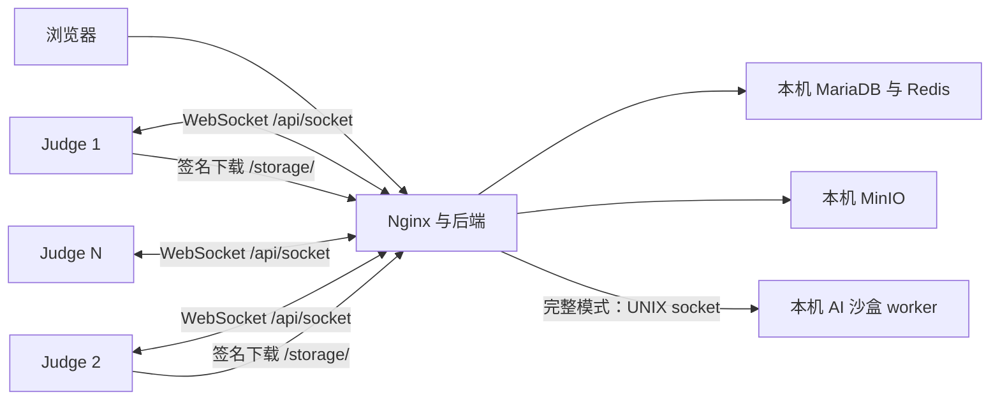

# 分布式评测与网页分离

[English](Distributed-Judging.md) | 简体中文

## 两种结构

推荐的 AI 完整结构：网页节点使用 `--role all`，保留本机评测和 AI 沙盒 worker；另加远程 judge 分担普通提交评测。纯网页结构：网页节点使用 `--role web`，普通提交全部由远程 judge 执行，本机不构建 rootfs。



judge 主动连接网页节点，不需要网页节点连接评测机的入站端口。远程 judge 不持有数据库、Redis 或 MinIO 管理凭据；它通过后端领取任务，使用短期签名 URL 下载测试文件并缓存，再回传结果。当前部署采用一个后端实例，不是后端数据库的高可用集群。

## 网页节点

纯网页安装示例，替换仓库与实际域名：

```bash
sudo bash /tmp/llmoj-install.zh-CN.sh --repository houyhlouis/LLMOJ \
  --role web --public-url http://oj.example.com
```

公网远程评测先按 [HTTPS](HTTPS.zh-CN.md) 配置最终 HTTPS 地址，或使用受控内网。HTTP 连接会明文传输评测密钥，不适合公网的长期评测连接。

安装器已为 `/api/socket` 配置 WebSocket Upgrade，并将 `services.minio.forJudge.urlEndpoint` 设置为最终 origin 下的 `/storage/`。Nginx 转发存储请求时恢复 MinIO 签名所使用的内部 Host。数据库及 MinIO 本身保持回环监听。

## 注册每台评测机

管理员通过 `POST /api/judgeClient/addJudgeClient` 注册客户端，请求体为 `{"name":"judge-01","allowedHosts":[]}`。

在已登录管理员的站点页面打开浏览器开发者工具 Console，执行下面的请求。它从当前页面状态取得会话，不输出或复制管理员 token：

```javascript
if (!window._appState?.currentUser?.isAdmin) throw new Error('请先登录管理员');
fetch('/api/judgeClient/addJudgeClient', {
  method: 'POST',
  headers: {
    'Content-Type': 'application/json',
    'Authorization': 'Bearer ' + window._appState.token
  },
  body: JSON.stringify({name: 'judge-01', allowedHosts: []})
}).then(response => response.json()).then(result => {
  console.log(result.judgeClient ? '客户端已创建；请从本次响应安全保存 key' : result);
});
```

在 Network 面板查看该次响应中的 `judgeClient.key`，仅保存到该评测机的私有 key 文件。每台机器注册不同客户端，使用不同 key；同一 key 的新连接会替换旧会话，不能让多台机器共享一个 key。

当前网关根据 key 认证；虽然 API 保留 `allowedHosts` 字段，当前连接逻辑不执行该字段的来源 IP 校验。不要把它当作访问控制措施；需要限制来源时在反向代理、VPN 或防火墙层配置。

## 部署及验收

按 [Remote-Judge](Remote-Judge.zh-CN.md) 部署每台 judge，使用与网页节点相同的代码版本和 rootfs 配方。日志出现“Successfully authorized as …”后，在管理员 Console 查询状态：

```javascript
fetch('/api/judgeClient/listJudgeClients', {
  headers: {'Authorization': 'Bearer ' + window._appState.token}
}).then(response => response.json()).then(result => {
  console.table(result.judgeClients?.map(({id, name, online}) => ({id, name, online})));
});
```

提交一个简单 C++ 程序，确认测试文件能下载、编译、运行并得到 Accepted；再验证编译错误、超时、内存超限和取消。多台节点分别验证，重启其中一台观察任务恢复。现有队列可由多个客户端消费，但不能把任务恢复理解为恰好一次执行的保证。

## AI 与纯网页限制

模型编辑、翻译、检索等后端 AI 操作可以继续配置。标程验证和生成测试数据使用本机 UNIX socket 与私有目录，未实现跨机器的 AI worker 协议。普通 judge 的分布式评测不自动迁移这些功能。

需要完整 AI 能力时采用 `--role all` 并保留本机 worker，再增加远程 judge；纯网页模式需接受上述执行功能不可用。不要用开放 TCP 或不受控共享目录替代本机 AI socket。

## 排错

- 连接失败：检查最终 origin、TLS、`/api/socket` Upgrade 和独立 key。
- 在线但下载失败：检查签名 URL 是否仍指向 127.0.0.1、19000 或不可达域名；核对 `/storage/` 转发与签名 Host。
- 多台互相掉线：检查是否共享了 key。
- cgroup 错误：检查 systemd 委托、统一 cgroup v2 和宿主内核能力。
- 增加节点后 AI 执行仍失败：检查网页节点是否保留本机 worker，分布式普通评测不能替代它。

尚未完成真实多机端到端验收；部署前应完成上述现场验证。
